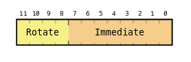

# Lecture 5

## Instruction Set Architecture - ARM ISA

* Each processor has a predefined set of instructions that it understands.
* The instruction set, along with the info about how the memory is organized, how to access mem, etc... is called programming model or ISA
* The ISA forms a contract between the machine and the programmer
* Relatively small number of ISAs (x86-64, ARMv7-A, Power ISA 3.0), but many processor implementation that conform to each ISA

## The ARM Processor

* Family of RISC processors that are used in many devices, smartphones and tablets mostly
* 95 billion ARM cpus shipped as of 2017
* ARM provides design of their processor to chop manufacturers, who fabricate it in the own products
    * Apple produced it's own A5 chip that has a dual-core ARM Cortex-A9 cpu.

### ARM ISA

* ARM has many ISAs and different implementation
* ARMv7-A is the ISA in iPhone 5 and Cyclone V SoC

*Note: the ARMv7-A ISA is very similar to previous ARM 32-bit ISAs*

* Word length: 32-bits
* Processor Registers are also 32-bits
* The ISA is RISC
    * All instructions are 32-bit
    * Only load and store access mem
    * All arithmetic and logic instructions operate on registers
    * Some features normally seen on CISC ISAs
        * Complex Instructions Set Computer

### ARM ISA Memory

* The memory is byte-addressable using 32-bit addresses
    * 2^32 addresses
    * only 1Gb is available on the DE1-SoC comp
* Memory is little-endian
* Word-aligned
* Word, half-word, and byte data transfers to and from processor registers

### ARM Register Structure

* 16 32-bit processor registers
    * Labelled R0-R15
    * Registers R15 is the program counter (PC)
    * Registers R13 (SP) & R14(LR) have dedicated uses
* In practice, use **only** R0..R12 as GPRs and only use and refer to R13..R15 as SP,LR,PC
* There is a status register called the CPSR that indicates various useful info


## ARM Assembly Language

* Assembly language consists of shorthand instruction names called *mnemonics*, and a *syntax* for using them
* A program called an *assembler* translates mnemonics into machine language instructions
* There are different ways to use each instruction

> ADD R1, R2, R3 // R1 <- [R2] + [R3]  
> ADD R4, R5, #24 // R4 <- [R5] + 24

These are examples of an instruction syntax:

> ADD Rd, Rn, Rm

Where `Rd` specifies the *destination* register and `Rn, Rm` are the *source* registers

### Instruction Encoding

* The machine language instruction is a binary string that is divided into *fields*. Each field contains some info that encodes information about the instruction


**Why are the register fields 4-bits wide?**

To store the register numbers (1 to 15)

> ADD R1, R2, R3

For this `ADD` instruction, a constant can be encoded in the instruction itself (the #).


## Addressing Modes

The different ways an instr can specify its operands are called *addressing modes*.

> ADD R1, R2, R3

Uses *register mode* for all its operands.

> ADD R1, R2, #24

Uses register mode for it's destinatino operand and one source operand and *immediate mode* for the other source operand.

### Effective Address

Loads/Stores don't specify a memory address explicitly, rather they *compute* an *effective address (EA)* from a *base address* and an *offset*

> LDR <Rd>, effective address // Not actual syntax
> STR <Rd>, effective address // Not actual syntax

```
EA = base + offset
```
### Base and Offset

* Base always stored in the register

**There are 3 kinds of offset:**

* *Immediate*: a 12-bit number that can be added or subtracted from the base register value
* *Index*: the offset is stored in a register
* *Scaled Index*: The value in the index register can be shifted by a specified immediate value, then added to or subtracted from the base register

*The base is always stored in a register*

### Shifting

Shifting by `k` bits to the left is equiv to mult by 2^k. Same goes for shift right: divide by 2^k

logical shift shifts and fills with zeros. Arithmetic copies bit in next position:  
log: 1001 -> 0100  
arith: 1001 -> 1100  

* *Logical* shifts (left or right) fill in zeros to the newly created positions
* *Arithmetic shift right* copies the sign bit into the newly created position (division be 2^k)

### Load/Store Addressing Modes

* *Offset mode*: EA is determined by adding or subtracting content of the base register with an offset
* *Pre-indexed mode*: EA is determined in the same way as offset mode; after mem access is performed the EA replaces the contents of the bas register
* *Post-indexed mode*: EA is the contents of the base register; after mem acces is done the base reg value is replaced by base + offset in the same way as calculated in offset mode.

*There's a nice memory addressing mode chart in the slides*


### Examples

**Offset Mode**  


> LDR R2, [R6, #-8]

> LDR R2, [R6, #0x200]

> LDR R2, [R6, -R8]

> LDR R2, [R5]

### Pointers

**I'm NOT PUTTING A DIAGRAM FOR POINTERS, YOU PLEBS SHOULD UNDERSTAND THOSE BY NOW**

* Pointers allow the same code to operate on diff data.
* A pointer's value is a memory address

> LDR R2, [R6, R8, LSL #4]!

R6: base reg  
offset: [R8] >> 4 or [R8] * 16  
!: overwrite  

*pre-indexed mode, new address in put in R6*

> LDR R2, [R6], #20

*post-indexed mode*

load content of R6 into R2  
Put conternt of R6 + 20 into R6  

### 2D Array

M is a 25x25 matrix of words stored in column order

|m(0,0)|m(0,1)|M(0,2)|...|m(0,24)|
|------|------|------|---|-------|
|m(1,0)|m(1,1)|      |   |       |
|m(2,0)|      |      |   |       |
| ...  |      |      |   |       |
|m(24,0)|     |      |...|m(24,24)|

The elements of the first row are stored at addresses:  
i, i+100, i+200, ..., i+2400 (100 = 25x4)


### PC-relative Addressing

* The PC can be used as the base register to acces mem locations in terms of their distance relative to PC+8
* The cpu updates `PC <- PC + 4` and then fetches the next instruction at that address, which starts executing *before* the current instruction is finished, so it also increment its PC by 4
* This is called pipelining


## Assembly Language

### ARM Instructions

**Load/Store Byte and halfword**

> LDRB

Load Register Byte - zero padded to 32 bits

> LDRH

Load Register Halfword - zero padded to 32 bits

> LDRSB

Load Register Signed Byte - sign extended to 32 bits

> LDRSH

Load Register Signed Halfword - sign extended to 32 bits

> STRB

Store Register Byte - stores low byte of `Rd`

> STRH

Store Register Halfword - Store the low halfword of `Rd`

**loading and Storing multiple registers**

* LDM & STM commands load and store blocks of words in consecutive mem addresses into mult registers
* Registers are always stored by STM in order from largest-to-smallest index (R15..R0) and by LDM in order from smallest to largest index
* To determine the direction in which mem addresses are computed, must use one of the following suffixes for the mnemonic to determine how to update the address:
    * IA - Increment after transfer
    * IB - Increment before transfer
    * DA - Decrement after transfer
    * DB - Decrement before transfer

> LDMIA R3!, {R4, R6-R8, R10}

### Constants in data processing instructions

Data processing instructions such as ADD can use 12-bit immediate values.


The ARM ISA has a very clever way of generating a lot of useful 32-bit constants: 16 possible rotations of an 8-bit value.




### Move Instruction

```asm
MOV     Rd, Operand2    // moves value of Operand2 into Rd
MVN     Rd, Operand2    // moves the complement of the value of Operand2 into Rd
MOVT    Rd, #immed16    // Move Top: moves a 16-bit constant into the high-order 16 bits of Rd and                         // leaves the lower bits unchanged
```

### Shift and Rotate Instructions

```asm
LSL     R2, R5, #4      // Logical shift left
ASR                     // Arithmetic shift left
ROR                     // Circular rotation right
```

### Arithmetic Instructions

```asm
ADD     R0, R1, R2, LSL #2

ADD     R0, R1, #-24

MUL R2, R4, R5

MLA R2, R4, R5, R6      // Multiply and Accumulate
```

### Logic Instructions

```asm
BIC     Rd, Rn, Operand2    // bit clear, performs AND NOT operation
AND     Rd, Rn, Operand2    // AND operation
ORR     Rd, Rn, Operand2    // Logical OR operation
EOR     Rd, Rn, Operand2    // Exclusive OR operation
```

### Test Instructions

> TST   Rn, Operand2

zero flag (Z) in the condition code flags set be result of AND(Rn, Operand2)

> TEQ   Rn, Operand2

zero flag (Z) set by result of XOR(Rn, Operand2)

Useful in conjunction with branch instructions

### Compare instructions

> CMP   Rn, Operand2

Sets condition code flags by result of `[Rn] - Operand2.` `Rn` not changed.

> CMN   Rn, Operand2

Sets condition code flags by result of `[Rn] - Operand2.` `Rn` not changed.

zero flag (Z) set by result of XOR(Rn, Operand2)

### Setting condition codes

* Test & compare instr always set condition codes, but so do other instructions.
* Data processing instr (arith, logic, move) affect cond codes if the suffix `S` is appended to the mnemonic

### Branch Instructions

> B{cond_suffix} LABEL

* Cond suffix specifies a test of the condition code bits
* If the condition is true, next instruction will be at address `LABEL`
* If the condition is false, next instruction will be after branch instruction (fallthrough)


### Conditional execution

* Most ARM instr can be executed conditionally
* the high-order 4 bits in the instr represent a condition
* If the condition is true, instr executes, otherwise doesn't
* This can save some branches, resulting in compact and fast code.

> OP{S}{cond}   Rd, Rn, Operand2

### Assembler directives

```asm
.text               // Marks the beginning of the code
.end                // Marks the end of the code
.global symbol      // Makes symbol visible outside of object file
.word expressions   // Reserves space for words in memory
```

### Loading 32-bit constants into registers

The assmbler uses:

> LDR   Rd, =value

to load a 32-bit value into register `Rd`.

The assembler will place the const `value` into a literal pool in the memory, where it can be read at runtime.

> LDR   Rd, [PC, #offset]

where `[[PC] + offset] = value`

**I'M NOT PUTTING THE INTRO TO C PART, YOU GUYS SHOULD KNOW THAT**
