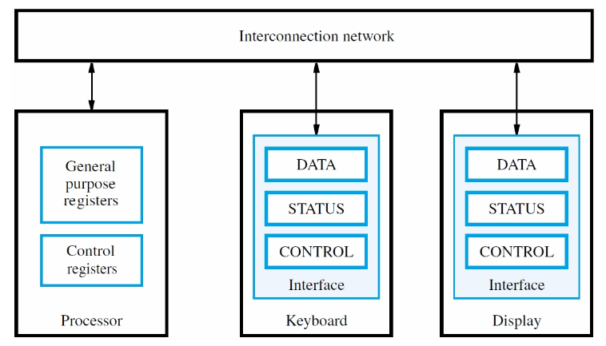
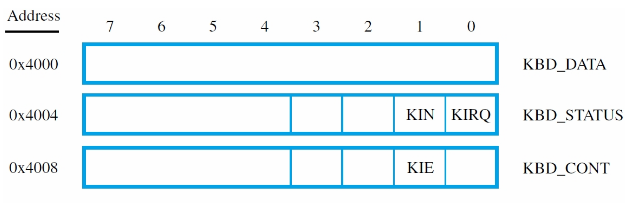
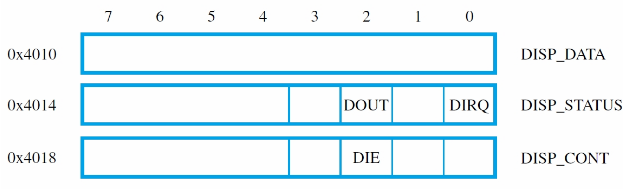
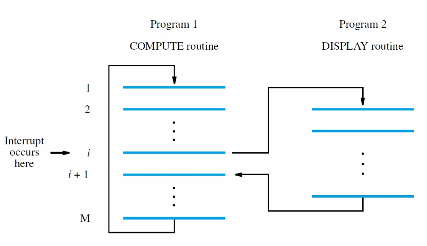

# Input/Output

### Accessing I/O Devices

Computer systems components communicate through an interconnection network. From a programmers point of view, locations implemented as **I/O registers** within the same address space.

### Memory-mapped I/O

Locations associated with I/O devices are accessed with load and store instructions

### I/O Device Interface

* An **I/O device interface** is a circuit between a device and the interconnection network.
* Provides the means for data transfer and exchange of status and control information.
* Includes **data**, **status** and **control** registers accessible with load and store instructions.
* Memory-mapped I/O enables software to view these registers as locations in memory.



### I/O Synchronization

E.g. Read keyboard characters, store in memory, and display on screen.

* A keyboard's data input rate (keyboard to processor) is likely to be only a few characters per second - limited by user's typing speed.
* The rate of character output (processor to display) is likely to be much faster - say thousands of characters per second.

The processor can execute billions of instructions per second - much faster than the display can accept data. Need a way to synchronize the timing of an I/O device with the CPU.

* How to know what time an input device has data ready for CPU to read?
* How to know when ouput device is ready to receive data?

### Program-Controlled I/O

Assume that the I/O devices have a way to send a  `ready` signal to the processor

* For keyboard, indicates character can be read so processor uses a load to access data reg.
* For display, indicates character can be sent so processor uses a store to access data reg.

The `ready` signal in each case is a **status flag** in **status register** that is *polled* by the CPU.

### Polled I/O: reading

Assume a divce with 8-bit I/O registers. For example, keyboard has `KIN` status flag in bit `b1` of KBD_STATUS register as address `0x4004`. The processor polls `KBD_STATUS` register, checking whether `KIN` flag is set to 0 or 1. If `KIN` is 1, processor reads `KBD_DATA` register.



### Polled I/O: writing

For example, display has `DOUT` status flag in bit `b2` of DISP_STATUS register at address `0x4014`. the processor polls `DISP_STATUS` reg, chacking whether `DOUT` flag is 0 or 1. If `DOUT` is 1, processor writes `DISP_DATA` reg. You have to poll a device's status reg for each time you read or write it's data register.



### Wait Loop for Polling I/O Status

Progam-controlled I/O implemented with a **wait loop** for polling keyboard status reg:

* Keyboard circuit places character in `KBD_DATA` and sets `KIN` flag in `KBD_STATUS`.
* Circuit clears the `KIN` flag when `KBD_DATA` is read.
* Assume that the address for `KBD_DATA` (0x4000) has be loaded into `R1`.

```asm
READWAIT:       LDRB    R3, [R1, #4]    // read byte from KBD_STATUS
                TST     R2, #2          // check the value of KIN
                BEQ     READWAIT
                LDRB    R3, [R1]        // read from KBD_DATA
```

* Display circuit sets `DOUT` flag in `DISP_STATUS` after previous character has been displayed
* Circuit automatically clears `DOUT` flag when `DIPS_DATA` reg is written
* Assume that the address for `DIPS_DATA` has been loaded into `R2`

```asm
WRITEWAIT:      LDRB    R4, [R2, #4]    // read byte from DISP_STATUS
                TST     R3, #4          // check the value of DOUT
                BEQ     WRITEWAIT
                STRB    R3, [R2]        // write from DISP_DATA
```

**Example**

* Consider complete program that use polling to read, store and display a line of characters ("echo" to the display)
* Program finishes when carriage return (CR) character is entered on keyboard.
* Assume `R0` points to the first byte of the memory area where the line is to be stored.

```asm
READ:   LDRB    R3, [R1, #4]    // load KBD_STATUS byte and
        TST     R3, #2          // wait for character
        BEQ     READ
        LDRB    R3, [R1]        // read the character and
        STRB    R3, [R0], #1    // store it in memory
ECHO:   LDRB    R4, [R2, #4]    // load DISP_STATUS byte and
        TST     R4, #4          // wait for display
        BEQ     ECHO            // to be ready
        STRB    R3, [R2]        // send char to display
        TEQ     R3, #CR         // if not carriage return
        BNE     READ            // read more characters
```

## Software aspects of I/O: Interrupts

**Interrupts**

* Polling with a wait loop has a big drawback: processor is kept busy.
* With a long delay before I/O device is ready, cannot perform other useful computation
* Instead of using a wait loop, an alternative is to let the I/O device alert the processor when it is ready
* Hardware sends an *interrupt-request signal* to the processor at the appropriate time
* meanwhile, CPU does other stuff.

**Examples:**

* Consider task with extensive computation and periodic display of results (~10s)
* A timer circuit can be used for 10s interval, sends a sig every 10s
* Polling would spend each 10s interval waiting for the signal, without doing computations.
* The timer can raise an interrupt-request signal to the processor every 10s.



### Interrupt-Service Routine

* `DISPLAY` is an *interrupt-service routine (ISR)*
* Unlike a subroutine, it can be *exectuded at any time*, not in response to a call.
* For example, assume interrupt signal asserted when processor is executing instruction i
* Instruction completesm the `PC` saved to temporary location before executing `DISPLAY` (`PC` set to the first instruction in the ISR)
* *Return-from-interrupt* intruction in `DISPLAY` restores `PC` with address of instruction i + 1

### Issues for handling of Interrupts

* Must save return address, processor registers and status registers since they could be changed by the ISR.
* After return-from-interrupt, the save info must be restored so that the original program can continue execution without being affected by the ISR
* Savin/Restoring of general-purpose regs can be automatic or program-controlled - usually the minimum is savec (PC and status reg) to reduce *interrupt latency*, the time before an interrupt is serviced after it is raised.
* ISR is responsible for saving any other registers.

### Acknowledging the Interrupt

* *Interrupt-acknowledge signal* from processor tells device that interrupt is recognized
* In response, device removes interrupt request
* Acknowledgement can be done by accessing status or data register in device interface

### Enabling and Disabling Interrupts

* We may only want to respond to the timer interrupt during the compute routine, but not at other times.
* Between the time the interrupt is requested and is acknowledged, we only want the ISR to be called once.
* Need a way to disable interrupts:
    * A bit in the processor status reg can globally disable interrupts.
    * A bit in I/O device control reg can disable interrupts from that device.

### Event Sequence for an Interrupt

1. Processor status reg has IE bit
2. Program sets IE to 1 to enable interrupts
3. when an interrupt is recognized, processor saves PC and Status reg
4. IE bit cleared to 0 so that same or other sigs do not cause further interrupts
5. after acknowledging and servicing interrupt, restored saved state, which sets IE to 1 again.

### Handling Multiple Devices

#### What if more than one device initiates an interrupt?

**How does the processor know which device is requesting an interrupt?**

Poll the IRQ bit in each device's status reg

**how is the starting address for the correct ISR obtained?**

Call device-specific routine for first set IRQ bit that is encountered. Service the interrupt and then the next interrupt can be serviced.

**Disadvantage:** Time is spent polling the IRQ bits of devices that are not requesting any service.

To reduce interrupt latency, use *vectored interrupts*

#### Vectored Interrupts

A requesting device identifies itself diretly with a device-specific signal or a binary ID code sent to the processor.

* the *interrupt-vector table* stores the address of (or a brach instruction to) the corresponding ISR.
* The interrupt vector table is located at fixed addess, typically the lowest memory addresses.

ISRs can be located anywhere in memory

#### Nested Interrupts

**Should a device be allowed to interrupt the processor while another interrupt is being serviced?**

Some devices need to be serviced quickly, even if it means interrupt a currently executing ISR.

* Assign a priority to each I/O device
* Only accept an interrupt from a device with higher priority than the device being currently serviced.
* Interrupts from lower-priority devices are ignored.
* An ISR should save the PC and SR on the stack and acknowledge the current interrupt before enabling nesting by enabling interrupts.

**How are two simultaneous requests handled?**

A way to resolve conflict (arbitration) is required:

* When polling I/O status registers, the service order is determined by polling order.
* Vectored interrupts require hardware arbitration based on priority and fairness.
* Hardware must select only one device to provide index to the vector table.

## Exceptions

An **exception** is any interruption of execution, not just for I/O

* Recovery from errors: detect division by zero, or instruction with an invalide OP code.
* Debugging: use of trace mode & breakpoints.
* Operating system uses software interrupts.

### Recovery from errors

* After saving state, service routine is executed
* Routine can attempt to recover (if possible) or inform user, perhaps ending execution
* With I/O interrupt, instruction being executed at the time of request is allowed to complete
* If the instruction is the *cause* of the exception, service routine must be executed immediately
* Thus, return address may need adjustment

## ARM Processor Modes

The ARM processor has 7 *operating modes* that determine what system resources a program has access to.

When an interrupt is received, the processor switches into one of two modes:

* IRQ mode - entered when a normal interrupt is received
* FIQ mode - entered in response to a *fast interrupt* request

### Banked Registers

Some modes have an extra set of shadow registers that are used instead of the usual register when in that mode.

* E.g. in IRQ mode, access to "R13" are to "R13_irq" instead of the real R13
* This avoids having to save registers - fast
* FIQ maintains a bank of shadow registers for R8-R12 as well - no need to save on stack

### ARM return-from-interrupt

Recall that in PC-relative addressing we had to consider that the PC is incremented by 8 because the processor prefetches the next instruction.

To return from the interrupt, fetch instruction i+1 by decrementing the address stored in the LR by 4.

## Bus Protocols

### Interconnection Networks

An *interconnection network* is used to transfer data among the processor, memory, and I/O devices. A commonly-used interconnection network is called a **bus**

### A Single-Bus System

* A bus is a set of shared wires
* Only one pair src/dest units can use the bus to transfer data at any one time
* Hardware manages access to the bus to enforce this constraint

### Tri-State buffers

* When the control signal "enable" is low the buffer is completely disconnected from the ouput f  *images needed*
    * When e is high, the buffer drives x onto y
    * The disconnected state "Z" is "high impedance"

### I/O interface for an input device

* Each I/O device is assigned a unique set of addresses for the registers in its interface

*image*

### Bus Protocols

* Set of rules that govern when a device may place info on the bus, when it may load data on the bus into one of its registers, etc...
* Control signals indicate what and when actions are to be taken
* `R/W` control line specifies whether a read or write is to be done (read when 1, write when 0)
    * Data size parameter (byte, halfword, word) can be indicated by other control lines.
* One of the two devices controls the transfer initiating the read or write commands (master) and the other is *slave*. usually, but not always, the processor is the master.
* Other control liens convey timing info. Two approaches to timing of bus transfers:
    * **Synchronous:** all devices derive timing info from a *bus clock*
    * **Asynchronous**

### Input (read) transfer timing on a synchronous bus

*image*

* Write is similar: master puts data on data lines at t0. An t2 the addressed device loads data into its data register
* Signals propagate to different devices at different times depending on their location on the bus
* Assume that the bus clock is seen at all devices at the same time.

#### A detailed timing diagram for the input transfer

*other image*

* Not all devices operate at the same speed
* t2 - t0 must be chosen to accomodate the longest delays on the bus and the slowest device interface
* All device must operate at the speed of the slowest device (synchronous SUCKS)
* Master assumes that the data is made available, or has been received at t2, but what happens if malfunction?

### Multiple-Cycle data transfers

* To address both of these issues, most bus protocols include a device *response* signal
    * A device response signal indicates that the address was successfully decoded and that it is ready to participate in a data transfer operation
* Can also be used to adjust the delay of a transfer op
    * Usually this is accomplished by allowing a data transfer to span multiple cycles

#### An input transfer using multiple clock cycles

*image*

### Asynchronous Protocol

* Timing automatically adjusts to delays - no bus clock
* Handshake protocol (exchange of command and response signal between master and slave) - each signal change results in a response: *full handshake* or *fully-interlocked*
* Data transfer is controlled by two interlocked signals: `Master-ready` and `Slave-ready`
* Whenever the processor takes an action, it waits for the device interface to respond before taking the next action, and vice-versa

#### Handshake control: input operation

*image*

*image*

### Synchronous vs. Asynchronous

* Async adjusts to the timing of each device automatically
* Sync requires careful timing design
* Async transfer requires four end-to-end delays (2 round trips)
* Sync transfer only requires one round trip
* Sync is used in modern high-speed busses

### Arbitration: granting access to a shared resource

Say several devices with to be bus master

* Multiple processors (cores) on the same bus
* processor wishes to write to bus, and an I/O device wishes to write directly to mem
    * *Direct memory access* (DMA)

### Bus arbitration

*image*

* Devices request bus mastership
* An arbiter grants the bus to the highest priority device
* Control lines on the bus are used to request and grant the bus

*image for granting the bus*

## Parallel and Serial Interfaces

### I/O Ports

* An I/O ports connects a device to the bus
* Parallel ports transfer several bits of data at once
* Serial ports transfer one bit at a time
    * Comm with the processor is still parallel - conversation from parallel to serial happens inside the interface circuit

#### Input Port: Kbd to CPU

*image x3*

**Detail of status flag control:**

* KIN is set by Valid and cleared by a read operation, but only when Master-ready is not asserted

*image*

#### An output interface

*image x3*

### Serial Links

* Many I/O interconns use serial data transmission
    * More suitable for longer distances
    * Less expensive
* Data are transmitted one bit at a time
* Requires a means for the receiver to recover timing info
* A simple scheme for low-speed transmission is known as "start-stop", using Universal Asynchronous Receiver Transmitter (UART)

#### UART

*image*

#### Start-stop Transmission

* Receiver and transmitter maintain their own unsynchronized clocks (fr ~ 16 ft)
* Sample at middle of bit: modulo-16 counter reset at leading edge of start bit. At count of 8, check if the signal is still 0, and then reset counter. Sample next 8 bits at count of 16.

*image*

### Synchronous serial transmission

* Async works by detecting the 1-0 transmission at the beginning of the start bit
* Very high speed transmission - the waveform is not square and async is hard to get working
* A sync transmitter inserts code (bit sequences) at the beginning of the transmission
* Receiver uses the knowledge of the code to generate a receiver clock that is sync'd to the transmitter clock

### I/O interconnection standards

* Standards facilitate system integration using from a variety of sources and encourage the dev of many plug-compatible devices.
* Perhaps the most commonly encouraged I/O standard today is the Universal Serial Bus (USB)
    * mem keys, printers, external disk drives, cameras, etc.

#### USB features

* speed
    * USB1: 12 Mb/s
    * USB2: 480 Mb/s
    * UBS3: 5 Gb/s
* Point-to-point connections using serial transmission and two twisted pairs (+5V, Ground, two data wires)
* Low-speed transmission is single-ended: one data wire for 0, other for 1
* High-speed transmission uses *differential signaling*
    * data encoded as the voltage diff between the two data wires
    * noise is cancelled as it is common to both wires
* Can connect many devices using simple point-to-point links and hubs
* plug-and-play
* Works by polling devices to resolve simultaneous messages

### PCI (peripheral component interconnect) bus

*image*

* Processor-independent motherboard bus
* Devices on the PCI bus appear in the address space of the processor

#### Reading 4 bytes from device on PCI bus

*image*

#### Plug-and-play

* PCI pironeered the plug and play feature, which made possible by the bus's intial connection protocol
* up to 21 device connectors on the PCI bus
* Each PCI-compatible device has a small ROM with info on device characteristics
* Processor scans all connectors to determine whether a device is plugged in
* Assigns an address to each device and reads the contents of its ROM
* With this information, it selects the appropriate device driver software, performs any initialization that may be needed, etc.

#### PCIexpress

* Point-to-point connections with one or more switches forming a tree
* Root complex provides high-speed prots for memory and other devices

#### PCIe Links

* Basic connection is called a lane
* A lane consists of two twisted-pairs or optical lines for eacn direction of transmission
* Data rate is 2.5 Gb/s in each direction
* A connection to a device (link) may use up to 16 lanes
* PCIe is compatible with PCI
