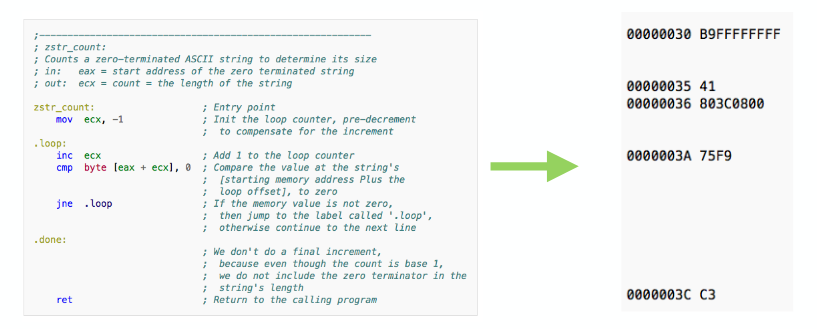
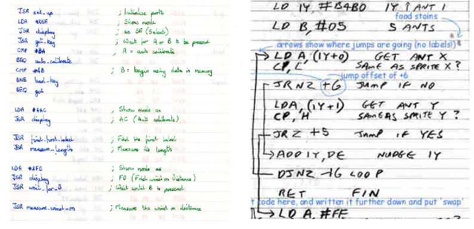
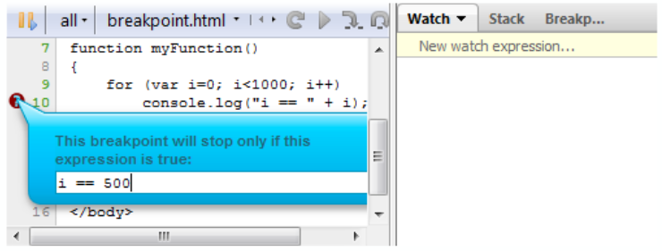

# Software

## Assembly Language

Assembly is a convenient **abstraction** designed for human **creation** and **consumption**.

* Computers don't naturally "speak" assembly

Before an algorithm, implemented in assembly, can be executed on a computer it must be:

* validated for correctness
* converted to a form consumable by a computer.
    * properly ordered machine code.

### Assembler

* verifies assembly code listings for validity, and
* converts valid **assembly opcodes** and **operands** into their associated **machine code values**
* computes a **memory layout** for the machine code

The assembler accepts assembly source listings, stored in an input text file, as input...  
...recognizes individual assembly instruction mnemonics (or doesn't)...

* interprets **addressing modes** and **data operands**

...converts them to their associated machine OP binary (or equiv) codes, lays out the OP codes in (relative) memory...

* usually in a sequential block of memory
* where do empty lines in the layout come from



#### OP Code Size

OP codes don't all occupy the same amount of memory

* varying number of data arguments
* compactness of addressing modes

*back to assembling*

...recognizes **data directives** and **labels**...

* allocates and populates space appropriately
* populates *symbol table* with label names & locations

...searches and replaces symbolic entries with their associated values from the symbol table.  
The assmbler outputs an **object program** to file  
We say that an assembler *assembles* to object code.

#### Early Assemblers: Pen, Paper & Books

Today, assemblers are programs that we execute on computers.

* using computers to program computers

In the past, humans had to *manually* assemble their own code.

* working through this process can be helpful



People had to:

1. write assembly code on paper
    * write instructions and comment
    * Lines show where the jumps/branches go
2. Sequentially replace assembler mnemonics (and data/addressing operands) with their binary machine OP codes
    * How? read the manual
3. Perform (manual) relative memory layout

#### Two-pass Assemblers

An important question arises during assembly, when substituting values from the symbol table:

* What happens if we encounter a label/name without an existing symbol table entry (a **forward reference**)?

```asm
.loop1:

    inc ecx
    cmp byte [eax + ecx]

    jne .loop2      // we don't yet have a value for the label loop2

.loop2:

    ret
```

* What's the problem here?
    * We don't know what .loop2 is when we first encounter it.

Two-pass assemblers solve this problem by:

1. making an initial pass: convert mnemonics and building the symbol table **when you can**
    * in this case, we have no clue what the .loop2 thing is
2. make a final pass filling in missing references, this time, .loop2 is in the symbol table so we know what it is.

### Loading & Executing Object Programs

Once an object program binary memory layout is generated, we can execute our assmbled program.

How?

* by invoking a *loader program*

#### Loader Program

The loader program has 3 responsibilities:

1. load object program's contents from file into memory
    * user identifies file via, e.g., command-line/GUI/etc.
    * loader needs to know: start address & program length
2. jump to starting address to execute program
    * i.e., sets the program counter the absolute start point
    * i.e., executes the first instruction of the object program
3. recover memory after program execution
    * program termination follows a predefined protocol
    * loader cleans up* and returns control to user

## Low and High Level Code Interaction

### Multi-source Object File Generation

So far, we assumed assemblers expected one source file & generated the object program file.

For small programs, this suffices, but why shouldn't we try to fit everything in a single *main.asm*?

ideally, we want the flexibility to split our code up across files.

### Linker

The linker works *in tandem* with the assembler

assemble sources files **separately**

* unlike the 1-source file case, the assembler may come across _external references_ that are _in another source file_

We need to deal with the fact that eternal references may not be resolved during a first (or second) pass through any single source file. So, now, an assembler has more responsibilities:

* follow the original two-pass process to generate:
    * memory mapped binary object content
    * an exportable symbol table
    * a list of **externally unresolved references**

After separately assembling each source file, we forward individual **object files** to the linker.

* each one stores (potentially incomplete) memory maps, symbol tables, and external references.

To resolve the references:

1. combine the object binaries into a single sequential memory map
    * eventually need a *globally consistent* (relative) memory map across individual object memory maps.
2. Linker identifies missing references
    * searches other symbol tables for it
    * and replaces it with the mapped (offset) address
    * any remaining external references are reported as errors

### Modularity

One benefit of using separate source files is the ability to group different functional units together.

* often, many different applications can benefit from similar (if not identical) functionalities
    * advanced math routines
    * I/O and file processing routines
    * image and sound processing routines
    * network routines
* Here, it would be unfortunate/foolish to have to reinvent the wheel every time

In the previous example, we assumed that every intermediate object binary is consumed.
    * once, and
    * only for the object program that is being linked

actually we can package routines into a **library**

Specifically, assemble + export: memory map, symbol and external reference tables for each object file (.lib file)

## High-level Programming Languages

Assembly language coding requires a thorough understanding of the underlying CPU architecture.

* pros:
    * understanding the implications of executed code
    * ability to fine-tune low-level behaviour
* cons:
    * iteration time
    * barrier to entry
    * propensity for human error

High-level programming languages reduce the need for such architecture-specific knowledge

* reduces the cost of cross-platform development
* decreases iteration time
* can simplify the design of larger, more complicated algorithms

### The Compiler

A **compiler** converts a high-level source file (or files) form the high-level language to assembly language.

* after which, it invokes the *assembler* to generate object files
* after which, the linker generates the final object program

High-level compilers typically allow code to be split up across files/modules, too

* external references need to be explicitly identified for use inside a separate module
* compiler will resolve names, external variable and subroutine addresses, at *compile-time*
    * except for subroutines & variables in external libraries
    * these are resolved at *link-time*

Compilers can also handle tedious tasks, like stack frame management for subroutines

* languages features may add type and range checking, etc.

### Compiler Optimizations

Compiled assembler code makes no guarantee on size nor computational efficiency

* for a long time, the battle between hand-optimized assembler & compiler-generated assembler waged on

Development of automatic and semi-automatic compiler optimization strategies remains an open area of applied research

* platform-dependent optimizations possible even on heterogeneous computer architectures.

### Multi-Language Software Development

* Compilers convert high-level source to assembler.
* Assemblers assemble source files to object data
* Linkers combine assembled objects data into the final object program machine data
    * linkers may also draw from pre-assembled & packaged library binary object data archives

Conceptually, nothing prevents us from:

* mixing and matching high-level + assembler source
* Using *many* different high-level languages

high-level languages can call assembler routines **and vice-versa**

* When calling assembler from high-level languages:
    * Assembler code needs to respect the same subroutine calling conventionsas the high-level language
    * High-level languages can "access" loew-level control
* Relying on separate assembler source listings can sometimes be cumbersome
    * Many compilers support *lower-level inlining* facilities

**Inlined assembler code**

```C
int main(void) {
    int time = get_time();

    /* add 10 and 20 and store result into register %eax */
    __asm__ ( "movl $10, %eax;"
              "movl $20, %ebx;"
              "addl %ebx, %eax;"
    );

    int result = -1;

    __asm__ ( "int $0x80"       // OS interrupt request
              : "=a" (result),  // return result in eax ("a")
                "+c" (time),    // pass time in ecx ("c")
              : "a"  (0x180)    // pass system call number in eax ("a")
              : "memory", "cc"  // notify compiler that memory and condition codes have changed
    );

    return result + 10
}
```

* When calling high-level routines from assembler:
    * need to match compiler-implemented subroutine calling mechanism/convention
        * pre and post conditions must match assembly and calling-language conventions
            * stack and/or heap
            * condition bits/flags
            * register post-conditions

## Debugger

The **debugger** is a software tool that allows to debug your application **while it runs**

* A more active way to track down and solve bugs
* Debuggers sophisticate the process of bug tracking beyond earlier passive, build-dependent strategies

Debuggers allow:

* Stop execution at any point
* examine ( and modify) the contents of registers, variables, and mem at this point
* resume execution until another point of interest

To expose this advanced debugging functionality, debuggers leverage two key facilities:

* Augmented build-generated object data
    * exposed through tools
* Execution level control
    * exposed through OS and HW

Modern dev toolchains (cross-compilers, compilers, assemblerds, linkers) allow:

* mapping high-level code to assembly
* embedding object binaries with debug meta-data
    * explicit function and variable sizes and layout info
    * source-matched function and var names

*Debug bulds* are, as result:

* less efficient and less compact

The ability of stopping, resuming, and modifying machine code and memory *during execution* requires more than just advanced dev tools

The OS and underlying HW platform must allow the disruption of normal execution protocols

* For example, the program counter is no longer the sole driving force of what gets executed next.

### Trace Mode

A special interrupt-based HW feature, called _trace mode_, is exposed to the OS (who in turn exposes to the debugger) to allow runtime debugging. When procesors run in trace mode, they fire an interrupt **after the execution of each instruction**

* The OS exposes an associated interrupt-handler
* control flow is then passed to debugger
    * can now execute commands to:
        * view and edit mem
        * view and edit regs and control flags
    * This interrupt is disabled during debugging
    * a return-from-interrupt is posted once the user commands regular execution flow continuation

### Breakpoints

The compiler/assembler and debugger allow source and instruction-level **breakpoints** to inserted in code.

* a similar interrupt-based facility is signaled upon the exectution of an instruction at a breakpoint
* control flow is once again passed to the debugger

Advanced dev tools will allow for complex conditional breakpoints to be defined in code.



### State-of-the-art Debuggers

A major differentiating technology between mature and immature software and hardware platforms is the **quality** and **capabilities** of the dev toolchains

* Not just the compilers, assemblers and linkers
* debuggers play a larger role here

Debugger development has remained an open area of applied research

* accommodating for more complex platforms
* More advanced debugging facilities

## The Operating System

At a high-level, the OS is responsible for:

* coordinating the execution of (potentially many) user-land application
* managing the resources exposed to users
    * sharing of HW resources
        * managing memory and I/O requests
    * providing the illusion of parallel execution
        * hiding latency from dependencies outside the processor

The *loader* is a component of the OS.

### The Boot-Strapping Process

What happens when you boot up?

Basic Input-Output System (BIOS) runs

* Initializes the system and sets the PC at a pre-determined starting point in mem
    * the *bootloader*
* booloader most likely boots your OS
* Sophisticated OSes are huge; during OS boot:
    * control of resources gradually passed to OS (*daemons* are deployed)
    * OS progressively loaded until user code is allowed to run.

### Life of App on OS

Life is hard

* allowed only direct access to a limited subset of the resources on the platform
* The OS decides when and how to dole out
    * CPU processing access; this is *time-shared* between apps
    * access to external resources, managed using *request-based mechanisms*
