# Memory

## Memory Technology

### RAM

* Memory access time
    * time from intiation to completion of a word or byte transfer
* Memory cycle time
    * minimum time delay between initiation of successice tranfers

*Random-access memory (RAM)* means that access time is the same, independent of location

#### Semiconductor RAM

* Organized as an array of *cells*, each storing one bit
* Each row of the arr stores on *word* (not processor word)

For example, consider 16x8 RAM with a 8-bit wordsize and 16 words

* How many bits does this memory store
    * 16 x 8
* how many bits are needed for the memory address
    * that many (?)

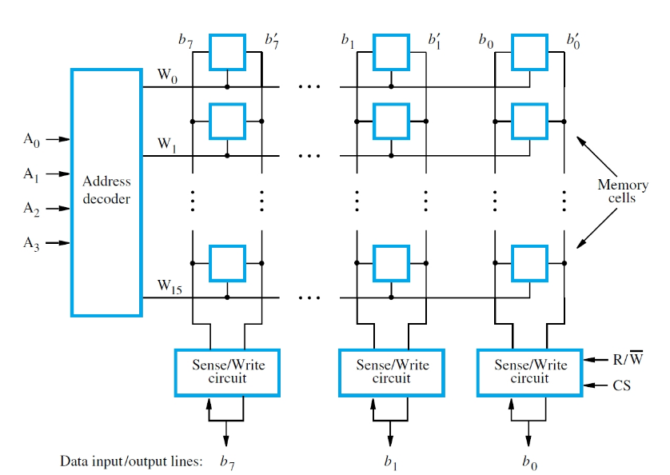

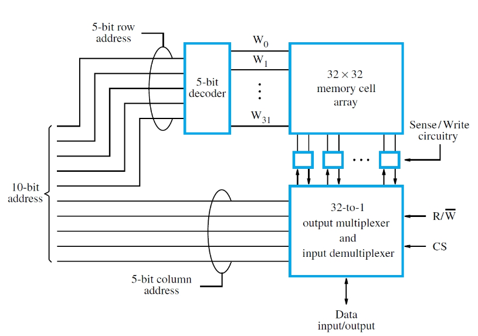

#### SRAM

* *Static RAM*: retains contents as long as power is applied, but *volatile* - if power is removed the contents are destroyed
* Fast (access time of few ns), but expensive - each cell require 6 transistors to store a bit
* SRAMs are limited to how large they can be - typically at most few Mbs
* Used in cache memory, but not the main

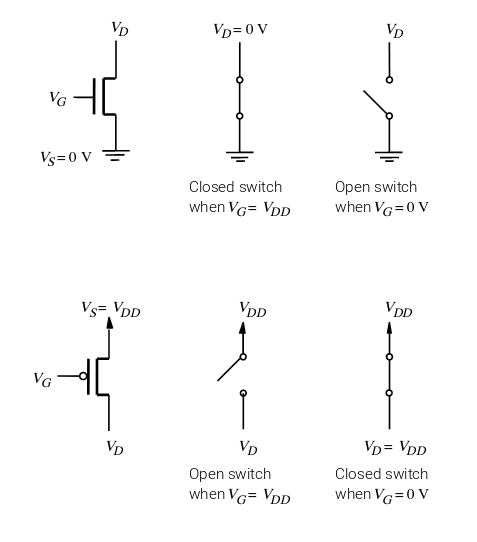

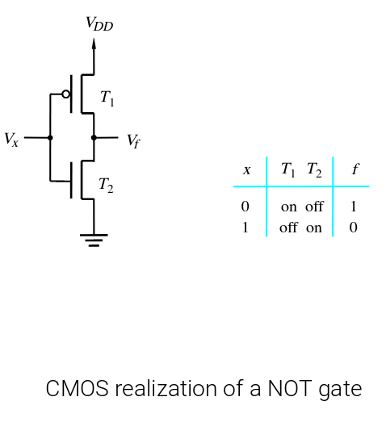

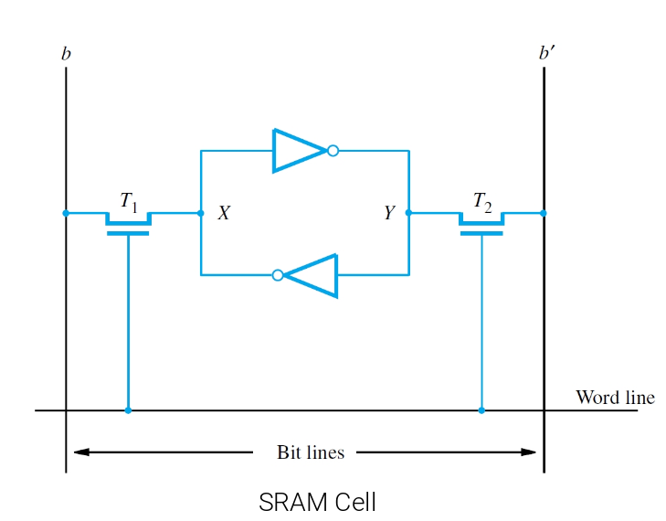

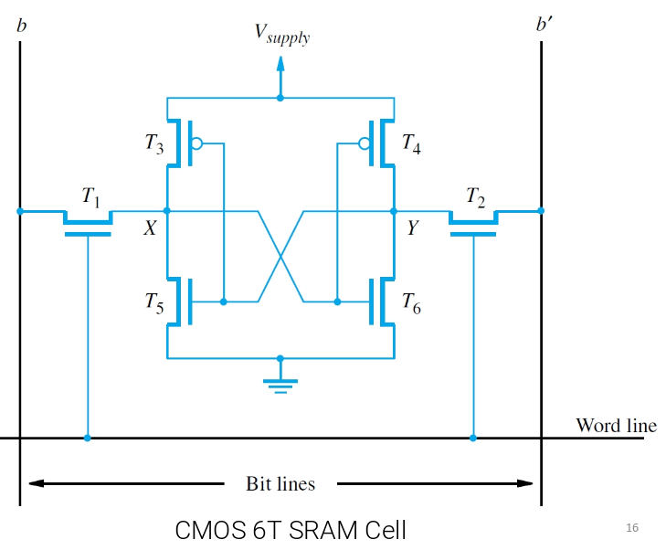

#### DRAM

* *Dynamic RAM*: retains contents for only a few tens of milliseconds and must periodically "refreshed" to maintain the contents for longer periods
* Slower than SRAM, but more dense (less expensive) - the cell is sompler than the SRAM cell
* Can implement DRAMs with large capacity (~Gb)
* Used for main memory

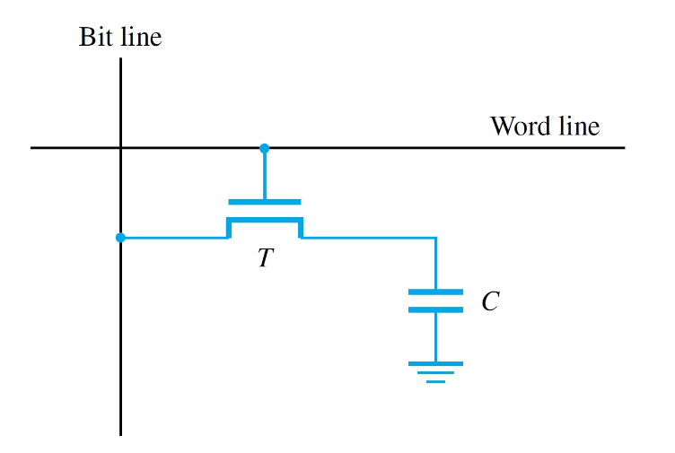

#### Reading DRAM

* *Read*: Sense amplifier connected to the bit line detects if the charge capacitor is above threshold
* If above threshold, the sense amplifier drives the bit line to full voltage ("1") and as a result the capacitor is recharged to full voltage ("1").
* If below threshold, sense amp pulls the bit line down to ground ("0") and the capacitor is discharged fully ("0")

-> **Reading a DRAM cell refreshes its contents**

To refresh the entire DRAM each row must be peridically read - done by an external memory controller.

#### Refresh Overhead

* Assume that each row needs to be refreshed every 64 ms, the minimum time between two row accesses is 50 ns and that all rows are refreshed in 8192 cycles
* Read/write operations have to be delayed until refresh is finished. What is the refresh overhead?

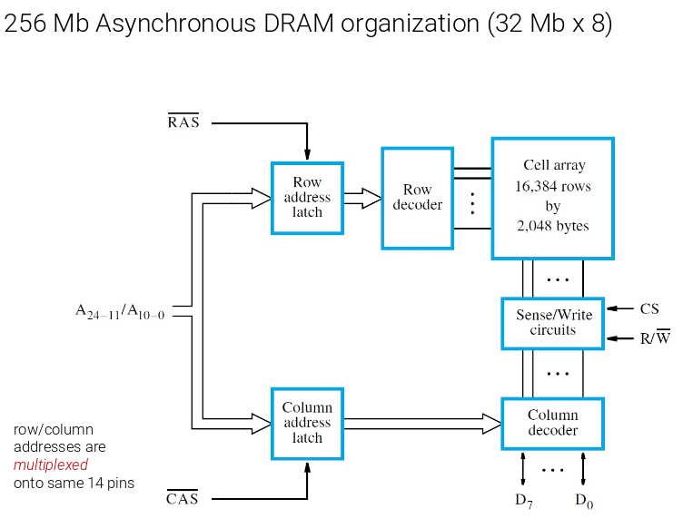

#### Fast Page Mode

* In last example, all 16384 cells in a row are accessed (and also refreshed as a result)
* only 8 bits of data are actually tranferred for each full row/column addressing sequence
* *latches* in sense amplifiers hold cell contents (more efficient)
* For consecutive data, just assert CAS signal and increment column address in same row
* *fast page mode* useful in block transfersi

#### Synchronous DRAMs

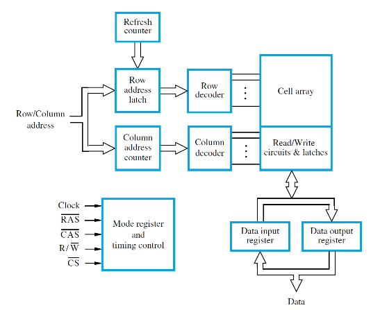

* Modern sync DRAM ( **SDRAM** ) uses clock to generate internal timing signals (CAS and RAS)
* Memory controller is integrated on-chip
* "dynamic" nature of chip is invisible to the user

#### Efficient Block Transfers

* Sync DRAM reduces delay by having CAS assertion *once* for intial column address
* SDRAM circuitry increments column counter and transfers consecutive data automatically
* Burst length determines number of transfers

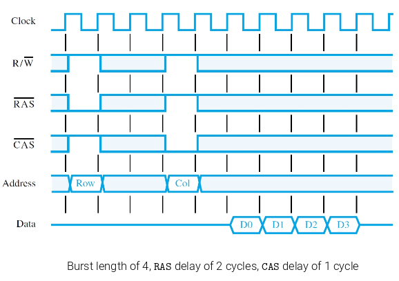

### Mem Latency and Bandwidth

* Memory *latency* (ns) is the time for the first word of a block tranfer to appear on the data lines
* The time between subsequent words is much shorter than the time needed to transfer the first word
* The mem *bandwidth* is a useful performance measure for a SDRAM

#### Double-Data-Rate (DDR) SDRAM

* Modern SDRAMs use both rising and falling edges od the clock ("double data rate")

e.g. DDR4 has a clock of 2133 MHz and can support up to 2400 MTransfers / second

## Non-volatile memories

* Non-volatile memories retain their contents even when the power is removed
* Slower than volatile memories and special procedure for writes
* Suitable for implementing long-term storage
    * Solid-State Disk (SSD)

### Read-only-memory (ROM)

contents only written *once*, at the time of manufacture

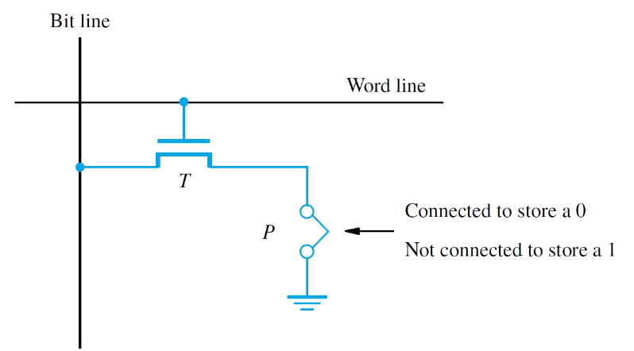

#### PROM, EPROM, EEPROM

* Cells of a *programmable ROM (PROM)* chip may be  written after the time of manufacture
* A fuse is burned out with a high current pulse
* An *erasable programmable ROM (EPROM)* uses a special transistor instead of a fuse
* Injecting charge allows transistors to turn on
* Erasure requires UV light to remove all charge
* An *electrically erasable ROM (EEPROM)* can have individual cells erased with a chip in place

#### Flash Memory

* High density, low-power and low-cost
* For higher density, flash cells are designed to be erased in larger blocks, not individually
* writing individual cels requires reading block, erasing block, then writing block with changes.
* Flash cells can only be written a certain number of times - wear levelling distributes writes to avoid wearing out one part of the memory before others
* Widely used in cell phones, digital cameras, and solid-state-drives

## Direct Memory Access (DMA)

* CPU overhead for block transfers between I/O and memory is high because because each transfer involves only a single word or a single byte
* Solutions:
    * *A direct memory access (DMA)* controller manages the transfer of larger blocks of data between memory & I/O devices
    * CPU intiates transfer, which is managed by the DMU unit without further CPU involvement

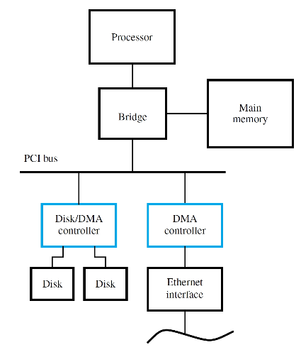

### DMA Controller

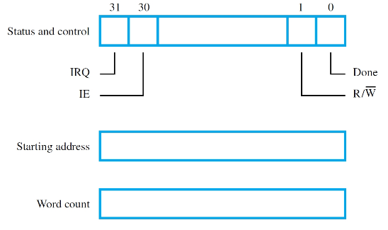

* shared, or in each I/O device
* Keeps track of progress with address counter
* Processor initiates DMA controller activity after writing information to special registers
* Processor interrupt used to signal completion

## Caches

### The problem

We want very large and very fast memory

* DRAM is large, but slow
* SRAM is fast, but small

Solution:

* Use both DRAM and SRAM in a way that the processor thinks it has a single large memory that is fast
* Should be transparent to the programmer

### Unlimited amounts of fast mem?

* Keep a **copy** of frequently used data in the small cache mem so that if it is needed again it is quickly accessible without going to the large main mem
* Specialized hardware manages the data between main mem and cache
* Transparent
* Having knowledge of how cache works helps write faster programs

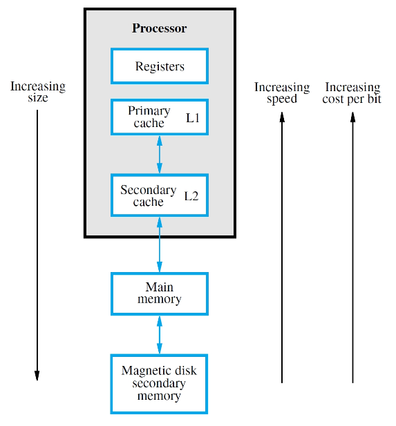

### So why does this work?

* This only works because humans write programs with structure
* If you look at a trace of memory addresses issued by the processor running typical programs, there's patterns
* This is called "locality" and is the reason caches work

### Cache Basics

* CPU requests an item
* if it is found in cache: **hit**
* *read hit*: deliver the desired item to the processor
* *write hit*:
    * **write-through**: write to both the cache and the main memory
    * **write-back**: only write to the cache. Update the main mem only when that cache block is removed from cache to make room. A **dirty bit** is set to indicated hte cache block has been changed and is no longer identical to the block in main memory.
* If it is not found in the cache: **miss**
* *read miss*: copy the block from main memory into the cache and then deliver the item to the processor
* *write miss*:
    * if write-through is being used, then write directly to the main mem on a write miss
    * if write-back is being used, first copy the block containing the addressed word into the cache, then write the new word in the cache block

### Hit and Miss rate

For a cache to make sense, most accesses to memory have to hit the cache. Not uncommon for caches to have a **hit rate** of > 95%

### Where to put blocks in the cache

Main mem is divided into *blocks* each consisting of several consecutive data elements (e.g. bytes)

Block in main mem must be transferred to the cache after a miss

* The *mapping function* determines the location
    * Some mapping functinos are simple, and some are more complex but have higher performance, i.e. result in a higher hit rate

### Direct Mapping

* Every mem block amps to a single cache block
* n = #blocks in cache

`memory block j -> cache block (j mod n)`

Simplest approach: uses a fixed mapping
Multiple blocks may contend for same location

* New block always overwrites previous block
* if have multiple frequently accessed blocks that kick eachother out of the cache, you will have many cache misses and suffer the penalty of having to go to main memory frequently

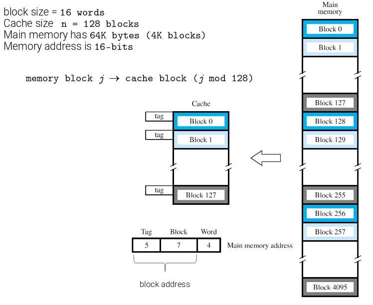

* Each cache block has some space to store the "tag" of the memory block that is currently stored in that block
* On an access, the tag of the requested address is compared with the stored tag.
* if they match -> cache hit!

### Associative Mapping

* The most flexible mapping: a main mem block can be placed into *any* cache block
* A block is only ejected from the cache if it is full
* the entire book address is the tag
* Check if a block is in the cache by doing an *associative search* of ALL the cache tags in parallel - complex!

### Set-Associative Mapping

* *k-way set-associative cache*: Group blocks of cache into *sets* of k blocks
* Direct mapping of a memory block to a specific - any block in the set can be used
* Associative seach involves only tags in a set (k=2, 4, 8)
* Direct-mapped = 1-way, associative = n-way

### Stale Data

* Each block has a valid bit, initialized to 0 upon startup to indicate the block is "empty" - set to 1 when a block is copied to the cache
* for a hit, valid bit must be 1
* e.g. DMA
* Disk -> Mem: cache may contain *stale* data from memory, so valid bits are cleared to 0 for those blocks
* Mem -> Disk: avoid stale data by *flushing* modified blocks from (WB) cache to mem

### Replacement policies

* Replacement is trivial for direct mapping, but need a method for associative mapping
* *least-recently-used (LRU)* algorithm
    * requires specialized hardware to track accesses to cache blocks in the set
* Another replacement policy is to remove the "oldest" block in the set
* Random replacement works surprisingly well

### Cache Example

A 4x10 array of 16-bit numbers is stored in an array *A* in column order. Normalize the elements of the first row of A with respect to the average value of the elements in the row.

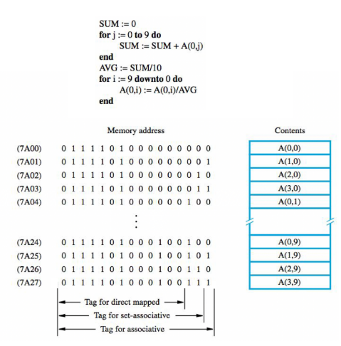

* Mem word size: 16 bits
* Word-addressable with 16-bit addresses
* Block size = one 16-bit word
* Cache size *n* = 8 blocks
* LRU replacement
* Consider direct mapped, associative and 4-way set-associative caches

#### Direct-Mapped

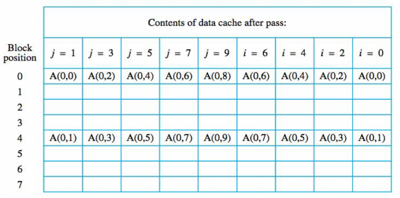

*To note*:

* Here, the 3 least significant bits determine the mapping of the blocks into the cache.
    * See the image above, A(0,0) has 000 as last 3 bits and A(0,1) has 100, hence why it is stored in block 4
    * If we were to store A(1,0), it would be in block 1 because its last 3 bits are 001
* The f mod n works here simply by knowing that 3 bits go from 0 to 7, meaning we can easily use those for mapping.

#### Associative

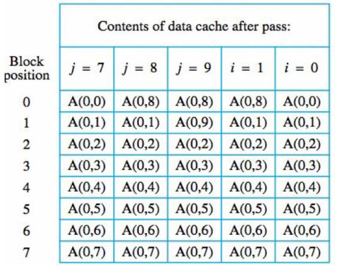

*To note*:

* Here, we don't give a damn, we just load elements in the order we need them. When the cache is full, we remove the Least Recently Used element (LRU).

#### Set-Associative

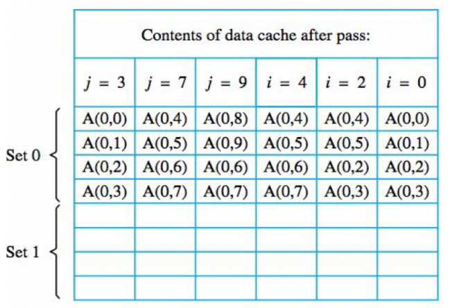

*To note*:

* Here, the assumption was made that there were 2 sets in the cache, and that the least significant bit was used to determine which set the block belonged to.

## Storage Storage Technology

### Secondary Storage

* Non-volatile long term storage
* Bottom of memory hierarchy -> slow but large capacity
* Managed by the OS
* Flash mem (SSD) is the technology used in phones, tablets, and most computers now
* Magnetic disks (hard drives) have lower cost/bit

### Magnetic Hard Disks

* One or more platters on a common spindle
* Platters are covered with thin magnetic film
* Platters rotate on spindle at constant rate
* Read/Write heads in close proximity to surface can access data arranged in concentric tracks
* Magnetic yokes and magnetizing coil can change or sense polarity of areas on surface

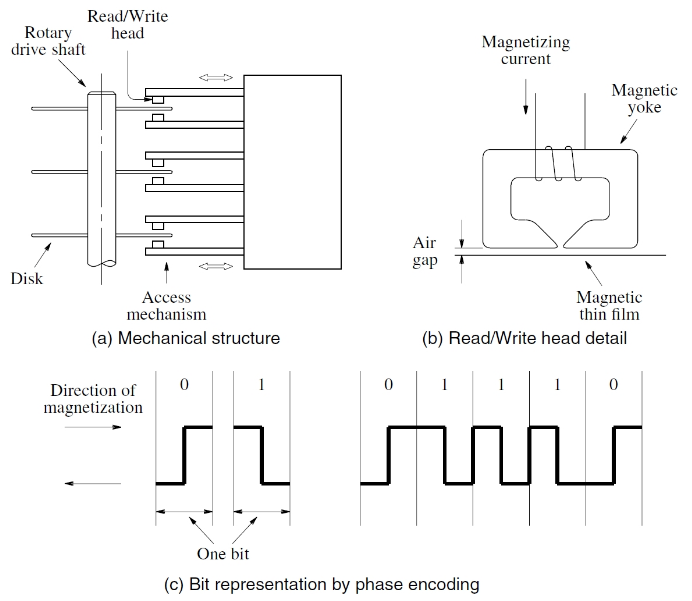

* A *cylinder* is a logical set of tracks on a stack of disks that can be accessed without moving the read/write heads
* Formatting information includes track/sector markers and *error-correcting code* (ECC) information
* *Filesystem:* data structures that the OS uses to keep track of files organized on the disk

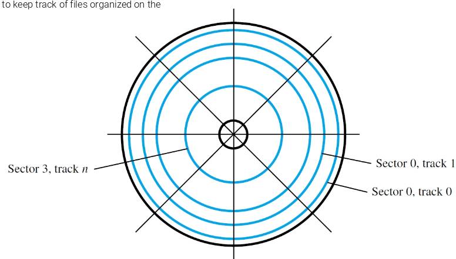

### Access Time

**Seek time**:

time required to move the read/write head to the proper track, depends on the initial position of the head.

* Average values are 5 to 8 ms

**Latency**:

(rotational delay) time to read addressed sector after the head is positioned over the correct track

* Average time for a 1/2 rotation

*Flash access time is typically 35 to 100 microseconds (100x faster)*

## Virtual Memory

* Physical mem. capacity smaller than address space size
* A large program or many active processes may not be entirely resident in the main mem
* Use secondary storage to hold portions exceeding memory capacity - makes RAM appear to be very large
* Virtual mem is the lowest tier of mem hierarchy
    * Mag disk (5ms) is 5 orders of magnitude slower than SDRAM (15ns)
    * It is important to manage virtual mem carefully to reduce nb of disk accesses - managed in software (OS)
* Programs written assuming full address space
* CPU issues *virtual addess (logical address)*
* Does normal operations when addressed contents are in mem
* When no current phys address exists, perform actions to place contents in mem
* Fully associative (reduce miss rate)

### Memory Management Unit

* Impl of virtual memory relies on a *memory management unit* (MMU)
* Maintains virtual -> phys addess mapping to perform translations
* If no phys address exists, MMU invokes OS services
* Causes transfer os desired contents from disk to the main mem using DMA scheme
* MMU mapping info also updated

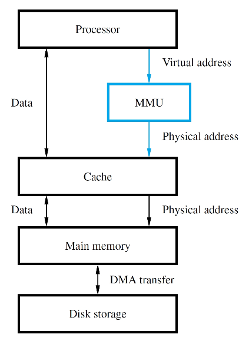

### Address Translation

* Use fixed-length unit of pages (2K-16K bytes)
* Larger size than cache blocks
    * Disks have high access times, but bandwidth of several MB/s (even GB/s nowadays)
* For translation, divide address bits into 2 fields
    * lower bits give *offset* of word within page
    * upper bits give *virtual page number* (VPN)
* Translation preserves offset bits, but causes VPN bits to be replaced with *page frame* bits
* *Page Table*, stored in main mem, provides info to translate

### Page Table

* MMU must know location of page table
* *Page table register* as starting address
* Adding VPN to base reg contents gives location of corresponding entry about page
* If page is in memory, table gives frame bits
    * If not, table may indicate disk location
* Control bits for each entry include: valid bit and modified bit indicating needed write-back
* Also bits for read/write permission

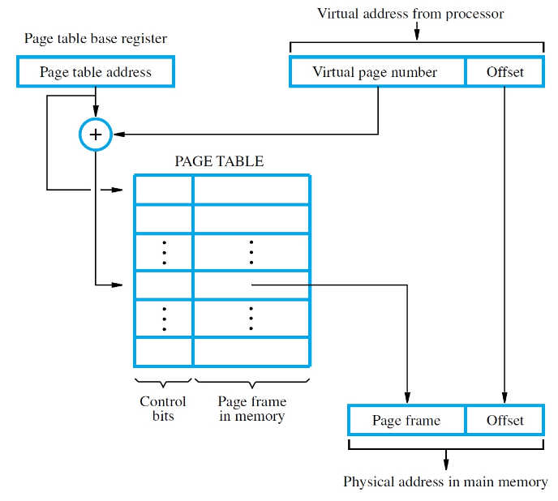

### Tanslation Lookaside Buffer

* MMU must perform lookup in page table for translation of every virtual address
* For large physical memory, MMU cannot hold entire page table with all its info
* *Translation Lookaside Buffer* in the MMU holds recently-accessed entries of page table
* Associative searches are performed on the TLB with virtual addresses to find matching entries
* If miss in TLB, access full table and update TLB

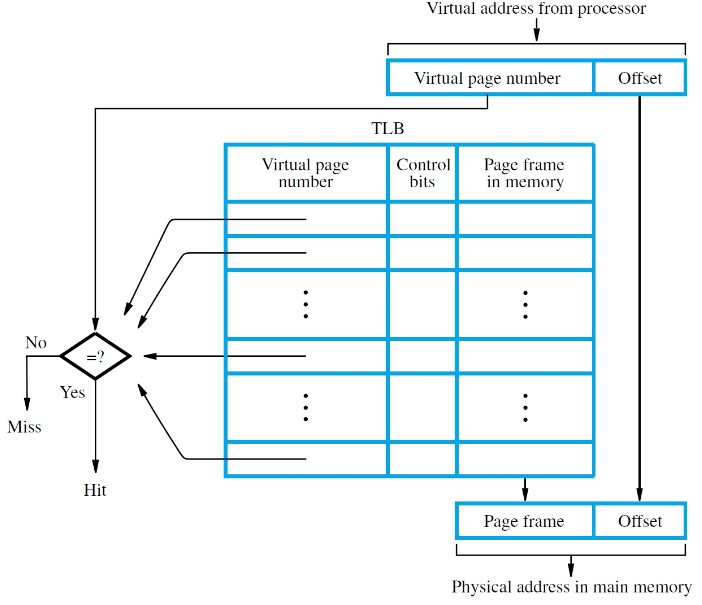

### Page Faults

* A *page fault* occurs when a virtual address has no corresponding physical address
* MMU raises an interrupt for OS to place the containing page into mem
* OS selects location using LRU, doing write-back if needed
* Delay may be long, involving disk accesses, hence another program is selected to execute
* suspended program restarts later when ready
