# Processor Implementation

## The Processor

A processor is responsible for reading program instructions from the computer's memory and executing them

* It *fetches* one instr at a time
* It *decodes* (interprets) the instruction
* Then, carries out the actions specified by the instruction

### Building Blocks

* `PC` holds the address of the next instruction to be fetched and executed.
* Instr is fetched into `IR`
* Instruction address generator updates `PC`
* Control circuitry decodes the instruction and generates control signals that direct the datapath

## Datapath Design

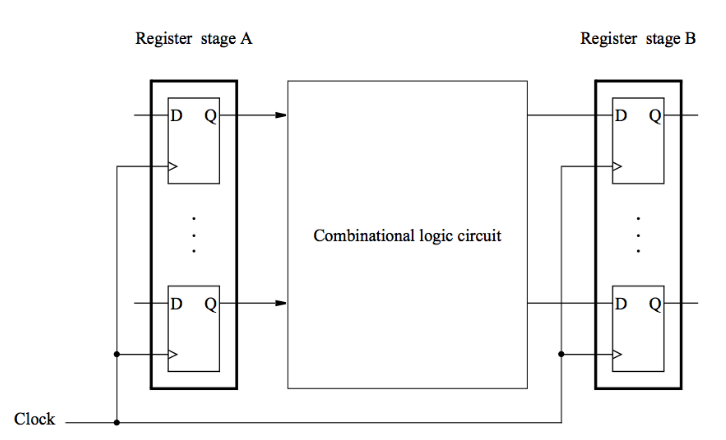

* Combinational circuits can be divided into simple subcircuits that are cascaded into a multi-stage structure

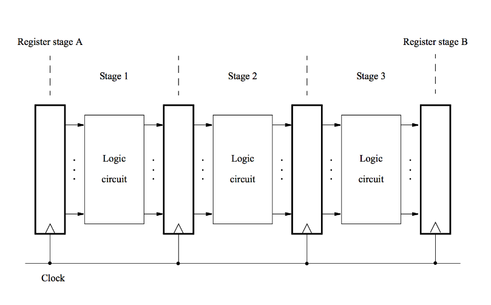

### Instruction Execution

* In RISC machines, all instr are executed in the same number of steps.
* Each step is carried out in a separated hardware stage.
* RISC CPU design will be illustrated in 5 hardware stages.
* The CPU design will model the basic RISC instructions and addressing modes, but not every detail of an ARM ISA.

#### Load Instruction

```asm
LDR R5, [R7, R8]
```

1. **Fetch** the instr and increment the program counter `PC`
2. **Decode** the instr and read the content of registers `R7` and `R8` in the register file
3. **Compute** the effective address
4. Read the **memory** source operand
5. **Write** the operand into the **destination register**

How can we decode the instruction and read the registers at the same time?

* In a RISC ISA, register fileds are always in the same positions in the instruction. If the registers weren't need, they'd be ignored.

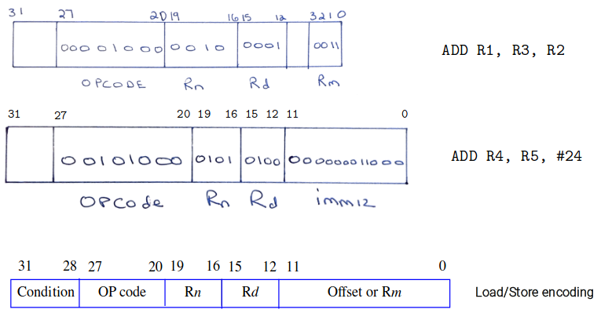

#### Arithmetic and Logical Instructions

```asm
ADD R3, R4, R5
```

1. **Fetch** the instruction and increment the program counter
2. **Decode** the instr and read registers `R4` and `R5` from the register file
3. **Compute** the sum
4. **NO ACTION**
5. **Write** the result into the **destination register**

*Stage 4 (memory access) is not involved in the instruction*

#### Immediate Operands

```asm
ADD R3, R4, #1000
```

The immediate operand is given in the instruction word and can be found in the IR.

1. **Fetch** the instruction and increment the program counter
2. **Decode** the instr and read registers `R4` from the register file
3. **Compute** the sum
4. **NO ACTION**
5. **Write** the result into the **destination register**

#### Load Instruction (immediate)

```asm
LDR R5, [R7, #X]
```

The immediate operand is given in the instruction word and can be found in the IR.

1. **Fetch** the instruction and increment the program counter
2. **Decode** the instr and read the content of register `R7` in the register file
3. **Compute** the effective address
4. Read the **memory** source operand
5. **Write** the result into the **destination register**

#### Store Instruction

```asm
STR R6, [R8, #X]
```

The immediate operand is given in the instruction word and can be found in the IR.

1. **Fetch** the instruction and increment the program counter
2. **Decode** the instr and read the content of register `R7` and `R8` in the register file
3. **Compute** the effective address
4. Store the contents of register `R6` into mem location `X + [R8]`
5. **NO ACTION**

### Summary - Actions to Implement an Instruction

1. **Fetch** an instr and increment the program counter
2. **Decode** the instruction and read registers from the register file
3. Perfrom an **ALU** operation
4. Read or write **memory** data if the instr involves a memory operand
5. **Write** the result into the **destination register**

## Hardware Components

### Register File

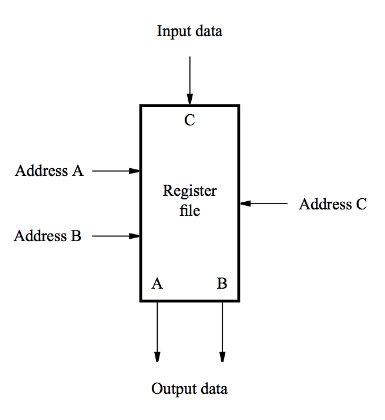

* A **2-port register file** is needed to read the two source registers at the same time
* It may be implemented using a 2-port memory

**Alternative implementation of 2-port register file:**

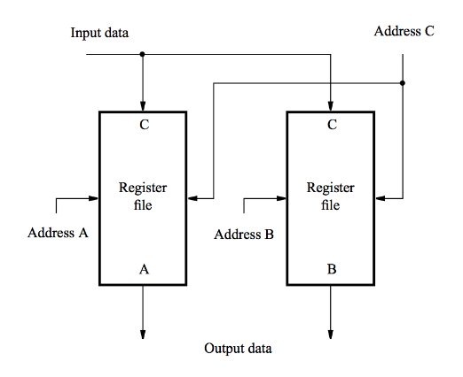

* Using two single-ported memory blocks each containing a copy of the register file

### ALU (Arithmetic Logic Unit)

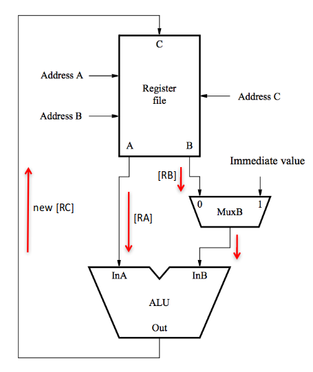

* Both source operands and the destination location are in the register file
* Conceptual single-cycle view of an ALU with two source operands in registers

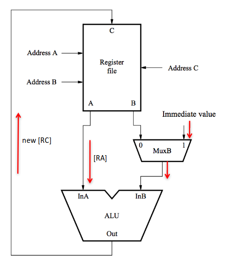

* One of the source operands is the immediate value in `IR`

### A 5-stage Implementation of a RISC processor

Instruction processing moves from stage to stage in every clock cycle, starting with fetch.

The instruction is decoded and source registers are read in stage 2.

Computation takes place in the ALU in stage 3.

If a mem operation is involved, takes place in stage 4.

Result of the instruction is stored in destination register in stage 5.

### Waiting for memory

* Assumed all mem accesses take one clock cycle.
    * Mostly realistic if we use cache
* In case of a cache miss, cpu must be stalled to wait for the memory access to complete (variable number of clock cycle)
* the cpu-memory interface generates a signal called *Memory Function Completed (MFC)*
* *Processor extends the duration of the memory step (in units of clock cycles) until MFC is asserted*

### The datapath - Stages 2 to 5

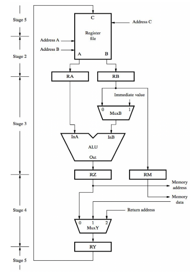

* Register file, used in stages 2 and 5
* Multicycle: Inter-stage registers `RA, RB, RZ, RY` needed to carry data from one stage to next
* ALU stage
* Memory stage
* Final stage to store result

#### Register File

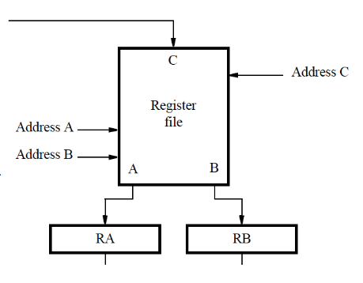

* Address inputs are connected to the corresponding fields in `IR`
* Source registers are read in stage 2; their contents are stored in `RA` and `RB`
* In stage 5, the result of the instruction is stored in the destination register selected by `Address C`

#### ALU stage

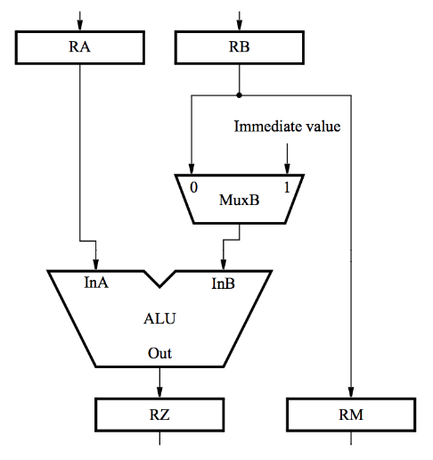

* ALU performs calculation specified by the instruction
* Multiplexer `MuxB` selects either `RB` or the immediate field of `IR`
* Results stored in `RZ`
* Data to be written in the memory are transferred from `RB` to `RM`

#### Memory stage

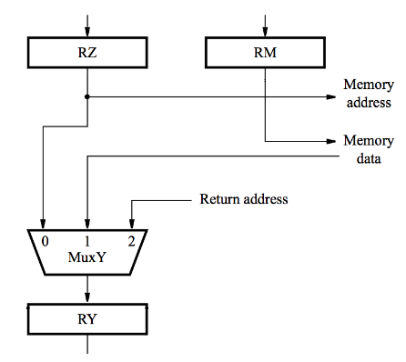

* For a memory instruction, `RZ` provides mem address, and `MuxY` selects read data to be placed in `RY`
* `RM` provides data for write operation
* For a calculation instr, `MuxY` selects `[RZ]` to be placed in `RY`
* Input 2 of `MuxY` is used in subroutine calls, it is the return address

#### Memory address generation

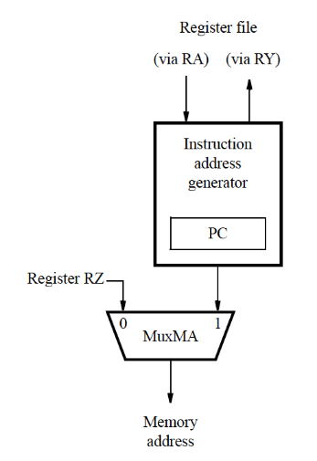

* `MuxMA` selects the `PC` when fetching instructions
* The Instruction address generator increments the `PC` after fetching an instr
* It also generates branch and subroutines addressses
* `MuxMA` selects `RZ` when reading/writing data operands

#### Processor Control Section

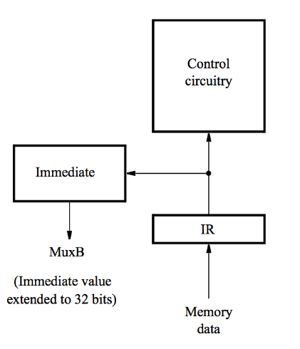

* When instr is read, placed in `IR`
* Control circuitry decodes the instr
* It generates control signals that drive all units
* Immediate block extends the immediate operand to 32 bits, according to instr type

#### Instruction Address Generator

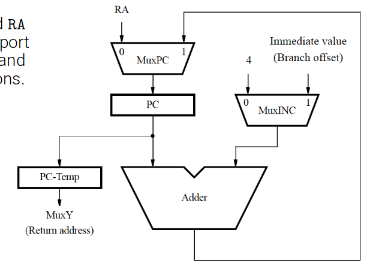

Connections to registers `RY` and `RA` are used to support subroutine call and return instructions

### Example

**ADD R3, R4, R5**

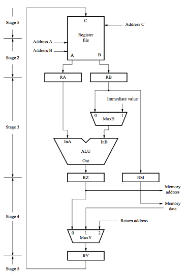

```asm
1.  Memory addess <- [PC],
    Read memory,
    IR <- Memory data,
    PC <- [PC] + 4

2.  Decode instruction
    RA <- [R4],
    RB <- [R5]

3.  RZ <- [RA] + [RB]

4.  RY <- [RZ]

5.  R3 <- [RY]
```

**LDR R5, [R7, #X]**

*refer to the same image*

```asm
1.  Memory addess <- [PC],
    Read memory,
    IR <- Memory data,
    PC <- [PC] + 4

2.  Decode instruction
    RA <- [R7],

3.  RZ <- [RA] + Immediate value X

4.  Memory address <- [RZ],
    Read memory,
    RY <- Memory data

5.  R5 <- [RY]
```

*Omitting the other examples*

**Conditional branch: BEQ R5, R6, LOOP**

*This one's a bit more interesting*

```asm
1.  Memory address <- [PC],
    Read memory,
    IR <- Memory data,
    PC <- [PC] + 4

2.  Decode instruction,
    RA <- [R5],
    RB <- [R6]

3.  RZ <- [RA] - [RB],
    If ALUiszero = 1 then PC <- [PC] + Branch offset

4.  NO ACTION

5.  NO ACTION
```

### ARM Datapath

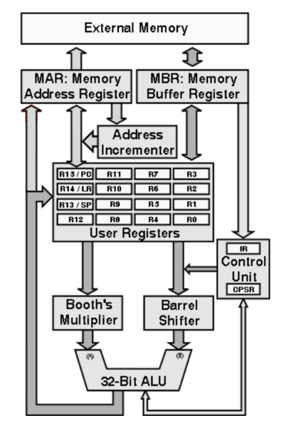

## Control Design

**Example RISC Instruction Format:**

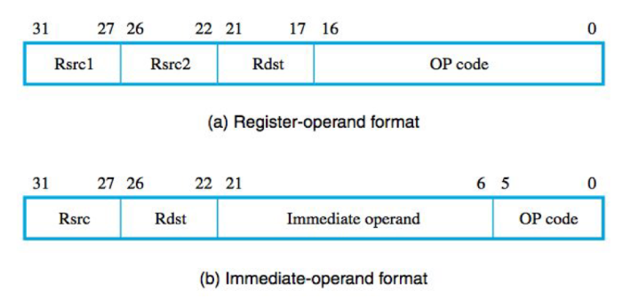

### Control Signal

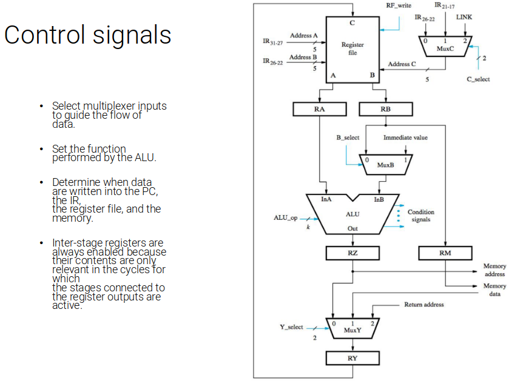

* Select multiplexer inputs to guide the flow of data
* Set the function performed by the ALU
* Determine when data are written into the PC, the IR, the register files and the memory
* Inter-stage registers are always enabled becuase their contents are only relevant in the cycles for which the stages connected to the registers are active

### Memory and IR control signals

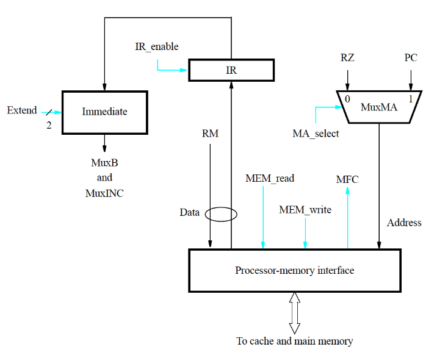

### Control signals of instruction address generator

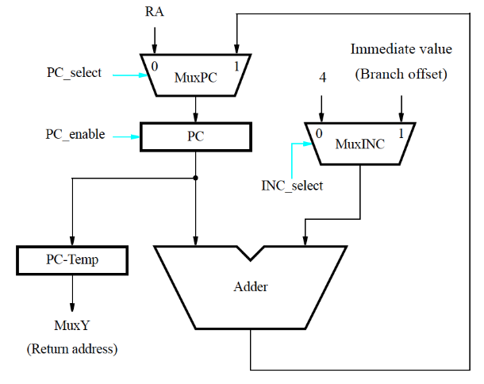

### Control Signal Generation

The control unit generates the control signals so the actions in the datapath take place in the correct sequence and at the correct time.

Two basic approaches:

1. Hardwired Control
2. Microprogramming

**Hardwired control** involves implementing a finite state machine (FSM)

* The state of the FSM is kept in a counter that keeps track of the execution step (one clock cycle/each step, unless mem access is too slow)

The inputs to the FSM are the IR, ALU result and external inputs such as interrupt requests. The outputs are control signals

#### Hardwired Generation of Control Signals

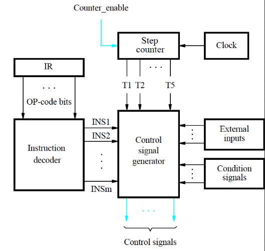

**Example:**

* Wait until `MFC` to be asserted before incrementing step counter in a step in which `MEM_read` or `MEM_write` command is issued.
* `Counter_enable` should be set to 1 in any step in which `MFMC` (wait for mem complete) is not asserted otherwise, it should be set to one when `MFC` is asserted
* Make sure the `PC` is incremented only once when an execution step is extended for more than on clock cycle
* `PC` should only be enabled when `MFC` is asserted, also in step 3 of branch instructions

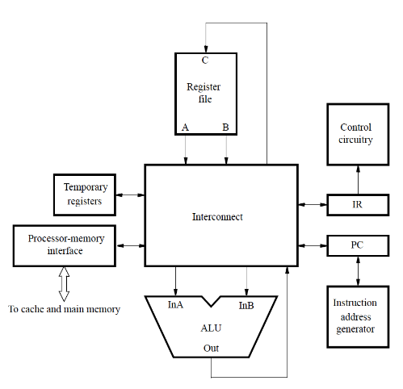

* CISC-style processors have more complex instructions
* Addressing modes that allow operands to be in memory, variable length instructions

### Bus

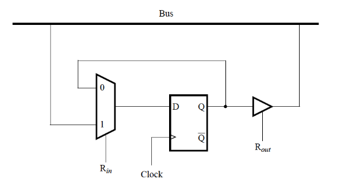

* An example of an interconnection network
* When functional units are connected to a common bus, tri-state drivers are needed

### A 3-Bus CISC Organization

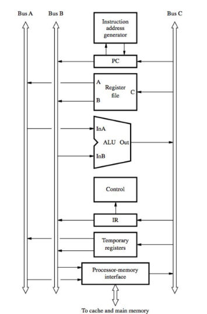

**Example: AND X(R7), R9**

```asm
1.  Memory address <- [PC], Read memory,
    wait for MFC,
    IR <- memory data, PC <- [PC] + 4

2.  Decode instruction

3.  Memory address <- [PC], Read memory,
    wait for MFC
    Temp1 <- Memory data, PC <- [PC] + 4

4.  Temp2 <- [Temp1] + [R7]

5.  Memory address <- [Temp2], Read memory,
    wait for MFC,
    Temp1 <- Memory data

6.  Temp1 <- [Temp1] AND [R9]

7.  Memory address <- [Temp2],
    Memory data <- [Temp1],
    Write memory
    Wait for MFC
```

### Microprogrammed control

* **Microprogramming** is software-based approach for the generation of control signals
* The values of the control signals for each clock period are stored in a **microinstruction** (control word) in a special memory
* A processor instruction is implemented by a sequence of microinstructions
* From decoding of an instruction in `IR`, the control curcuitry executes the corresponding sequence of microinstructions
* (mu)PC maintains the location of the current microinstruction

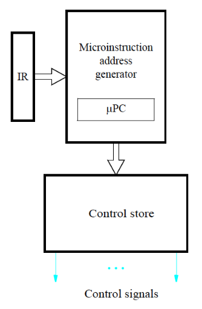

Microprogramming provides needed flexibility to implement more complex instructions in CISC processors.

However, reading and executing microinstructions incurs undersirably long delays in high-performance processors

## Pipelining

### What is pipelining?

* Pipelining is applying the "assembly line" concept to the execution of instructions
* Multiple instructions can be executed simultaneously
* Divide the instructions into distinct steps
* Overlap the execution of the five steps by allowing the hardware for each step to work on the next instruction in the program after it is done working on the current instr

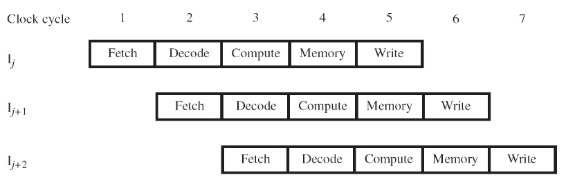

### Pipeline Organization

* Use `PC` to fetch instr
* New instr enters pipeline every cycle
* Carry along instruction-specific information as instr flow through the different stages
* Use **interstage buffers** or **pipeline registers** to hold this info
* These buffers incorporate `RA, RB, RM, RY, RZ, IR` and `PC-Temp` registers
* Also holds control signal settings

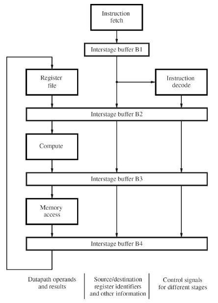

### Data Dependencies

```asm
ADD     R2, R3, R7
SUB     R9, R2, R8
```

* Destination `R2` of add is a source for subtract
* **data dependency** between the two instr because of `R2` carrying data from add to sub
* On non-pipelined datapath, result is available in R2 because Add completes before sub

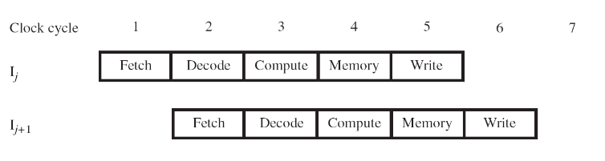

* The pipeline doesn't allow the simultaneous execution of these particular instr because of the dependency
* This is called a **data hazard**

### Stalling the Pipeline

* With pipelined execution, old value is still in registed `R2` when SUB is in decode stage
* So **stall** SUB for 3 cycles in decode stage
* new val of `R2` is then available in cycle 6

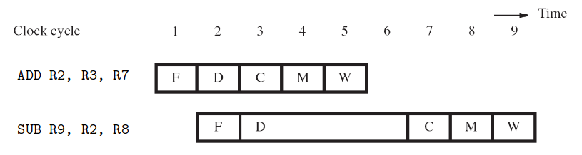

* Control circuitry must recognize dependency while SUB is being decoded in cycle 3
* Interstage buffers carry register identifiers for source(s) and destination of instructions
* @ cycle 3, compare destination identifier in Compute stage against source(s) is decode
* `R2` matches, so SUB kept in decode while add allowed to continue

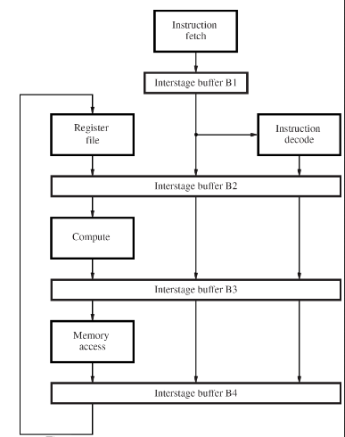

* Stall the SUB instr for 3 cycles by hoding interstage buffer `B1` contents steady
* What happens after ADD leaves compute?
* Control signals are set in cycles 3 to 5 to create an *implicit* `NOP`(NO OPERATION) in Compute
* NOP control signals in interstage buffer B2 create a cycle of idle time in each later stage
* The idle time from each NOP is called a *bubble*

### Can we avoid stalls?

* Operand **forwarding** handles some dependencies without the penalty of stalling the pipeline
* For the preceding sequence of instructions, new value for `R2` is available at end of cycle 3
* *Forward* value to where it is needed in cycle 4

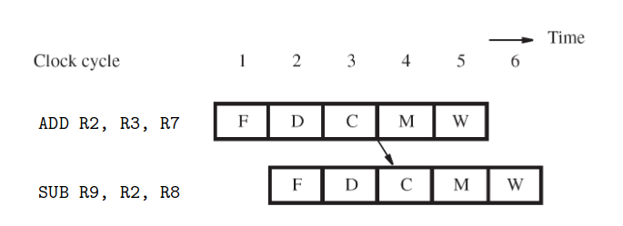

### Forwarding hardware

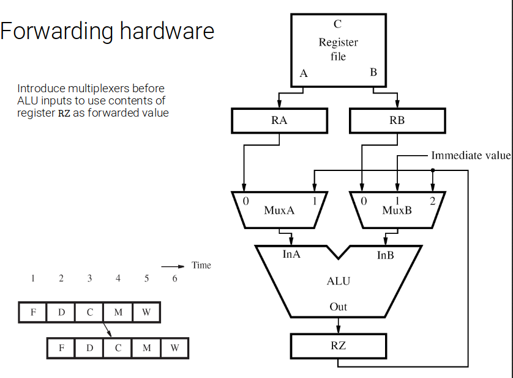

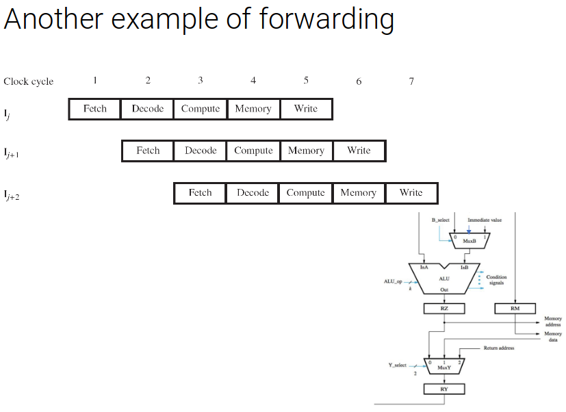

### Software Handling of Dependencies

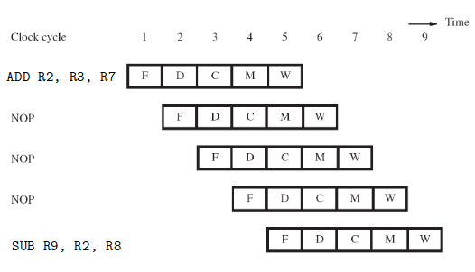

* Data deps are evident at compile time
* Compilers puts 3 *explicit* NOP instrs between instrs having a dependency
* Delay ensures new value available in register but causes total execution time to increase
* Compiler can *optimize* by moving instructions in to NOP slots (if data deps permit)

### Memory Delays

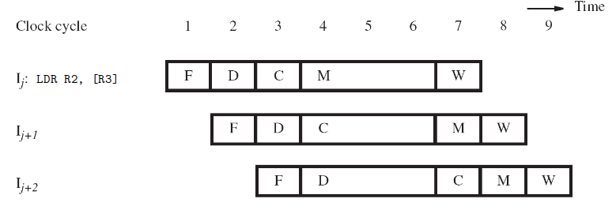

* Even with a cache *hit*, a load instr may cause a short delay due a data dep
* one-cycle stall required for correct value to be forwared to instr needing that value
* Optimize with useful instr to fill delay

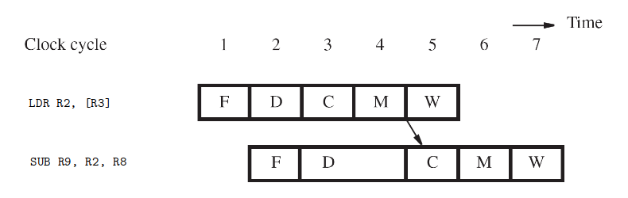

### Branch Delays

* Ideal pipelining: fetch eachnew instr while previous instr is being decoded
* Branch instr alter execution sequence - the branch instr has to compute the target address and also perform comparison to determine if we go to the target or fall-through instr next
* Since these computations happen in later clock cycles, there is a hazard created when pipelining a branch instr

### Unconditional Branches

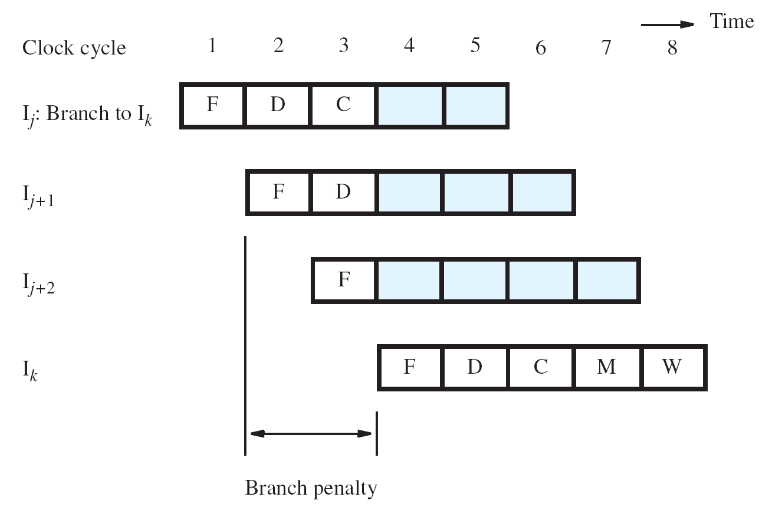

### Reducing the Branch Penalty

* Must compute the target address earlier in the pipeline
* Introduce a second adder dedicated to computing the branch target in the decode stage

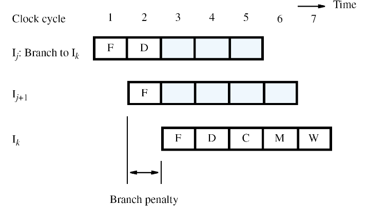

### Conditional Branches

* Requires not only target address calculation, but also requires comparision in ALU for cond
* Target address now calculated in decode stage

### Delayed Branching

* Assuming both branch decision and target address are dtermined in deocde stage of pipeline, there is still an unavoidable branch delay of one cycle
* Allow compiler to fill the **branch delay slot** with a useful instruction, usually from before the branch
    * Alter the pipeline operation so that the instruction immediately following a branch is **always** fetched and executed, regardless of branch decision
* If no suitable instr can be found to fill the slot (because of deps) the compiler must put a NOP in the slot

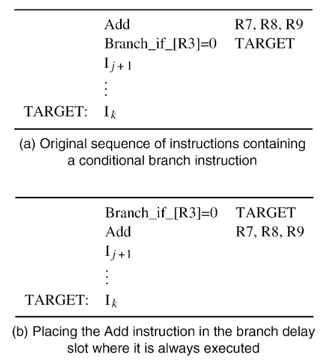
